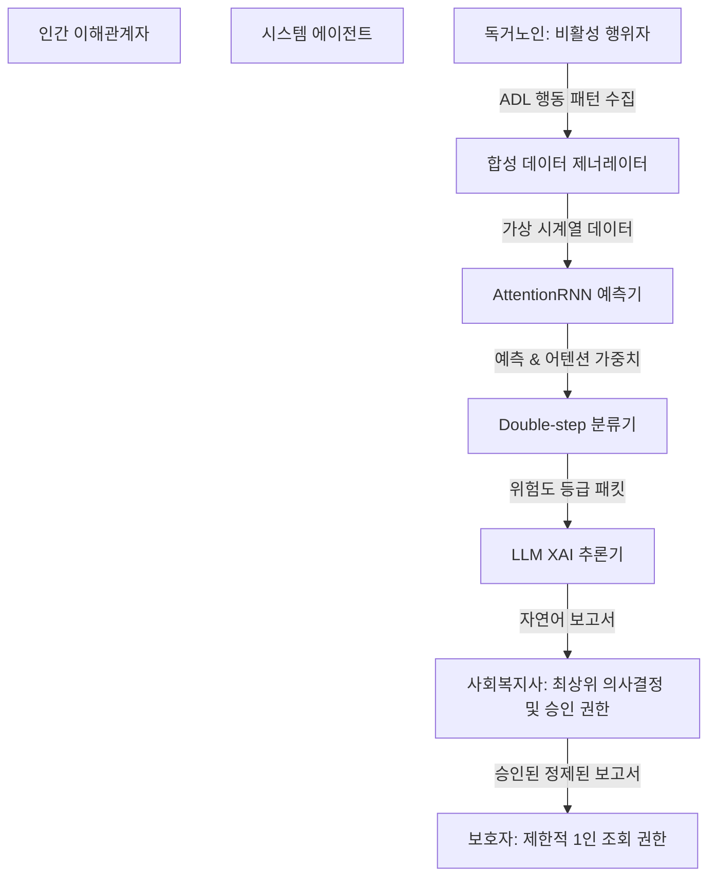
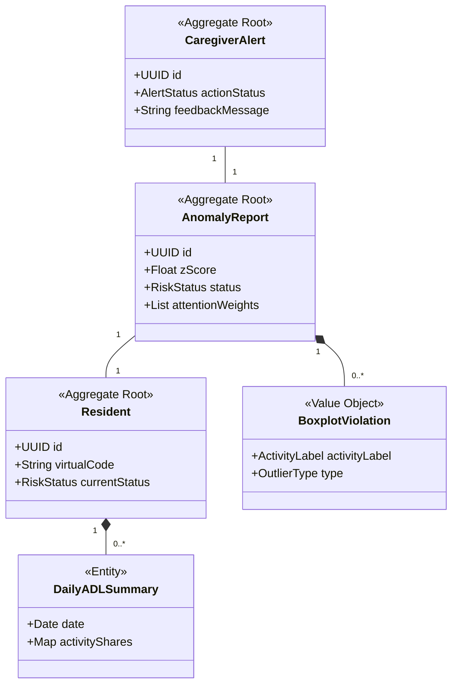

# 프로젝트 컨텍스트 상태 관리 패킷 (context_packet)

본 문서는 프로젝트의 현재 진행 단계, 컨텍스트 요약, 그리고 다음 마일스톤을 실시간으로 추적하여 상태의 일관성을 유지하기 위해 작성되었습니다.

---

## 1. 현재 프로젝트 상태 마킹

* **대단계**: Phase 7 - API 비의존형 XAI Fallback 보고서 검증 완료 (XAI Validation Complete)
* **소단계**: check_db.py PII 검출 오탐 수정 및 신규 자동화 테스트 완료 (10/10 Passed)
* **최종 업데이트 시점**: 2026-05-31T22:20:00+09:00
* **상태 요약**: 로컬 가상환경 BDD 테스트 8건 통과 및 attention_rnn.pt 실모델 추론 가동 환경 하에서 무과금 Fallback XAI 보고서 생성 안전성을 검증하였으며, `check_db.py` 의 성명 오탐 정규식('이탈', '이상' 등)을 문맥 키워드 지정 및 예외 사전 필터 구조로 수정하여 PII Leak Detection 0건을 달성함. 신규 BDD 단위 테스트(`test_pii_detection.py`) 2건을 추가하여 전체 자동화 테스트 통과 수를 10건으로 확대하였으며, Docker 환경 런타임 구동은 로컬 환경 제약상 미확인 상태로 유지함.

---

## 2. 기획 및 이해관계자 컨텍스트 요약

### 2.1. 요구사항 및 BDD 수용 기준 바인딩 요약
1. [FR-01/Scenario 1] 시계열 합성 데이터 정규화:
   - CASAS 41개 ADL 일간 점유율 합성 시 시나리오 주입 기능을 확보해야 하며, 생성된 데이터의 일일 총합은 강제 정규화를 통해 정확히 100.00% (오차 범위 0.01% 이내)의 무결성을 만족해야 함.
2. [FR-02/Scenario 2] AttentionRNN 15일 윈도우 예측:
   - (Batch, 15, 41) 규격의 시계열 데이터를 처리하여 16일 차 예측 텐서 (Batch, 41) 및 15일 가중 기여도를 나타내는 Attention weight를 정상 산출해야 함.
3. [FR-03/FR-04/Scenario 3] Double-step 판정 및 LLM XAI 보고서 자동 연계:
   - 예측-실측 간 MAE 오차의 Z-score 1차 검증(Z > 2.5일 시 고위험) 및 역사적 Boxplot IQR 영역 2차 검증을 거친 후, LLM이 환각 없이 사실에만 기반하여 "의료적 최종 진단 아님" 헤더 문구를 포함한 자연어 한글 보고서를 최종 출력해야 함.
4. [NFR-01/02/03] 주요 품질 속성 제약:
   - 딥러닝 추론 속도 100ms 이내, LLM 생성 속도 5초(상용)/15초(로컬) 이내 보장.
   - 단선 시 최근 3일간의 행동 데이터 가중평균값(0.5, 0.25, 0.25)으로 결측치 자동 대체 보강(Imputation).
   - 모든 XAI 리포트에는 개인식별정보(PII) 조회를 완전 차단하고, 익명 UUID v4 체계로 분석 정보를 전달해야 함.

### 2.2. MVP 개발 범위 및 아키텍처 제약조건 동결 (Context Freeze Payload)
* MVP 필수 구현 (Must-Have): CASAS 41개 ADL 일간 점유율 합성 제너레이터, AttentionRNN 훈련 및 추론 파이프라인, Z-score + Boxplot IQR 이중 이상 탐지, LLM 돌봄 보고서 XAI 추론기, Streamlit 복지사 웹 대시보드 UI.
* MVP 강력 제외 (Won't-Have): 스마트홈 물리 하드웨어 센서 및 실시간 수집 연동, OAuth2 고도화 다중 권한 보안 레이어, 모바일 기기(iOS/Android) 이식 패키징, 실시간 분산 스트리밍(Kafka 등) 프레임워크 설계.

### 2.3. 도메인 개념 모델 구조 (DDD Aggregates Structure)

### 2.4. 시스템 아키텍처 및 의존성 가이드라인 (Architecture Guidelines)
* 의존성 단방향 제약: domain -> usecases -> infrastructure / presentation 단방향 흐름 고수. 도메인 코어는 다른 어떠한 레이어도 임포트하거나 참조하지 않고 순수 파이썬 데이터 구조 및 도메인 규칙만 포함함.
* 외부 프레임워크 격리: PyTorch 기계학습 모듈, OpenAI SDK 클라이언트, Streamlit 웹 컴포넌트는 전적으로 infrastructure/ 및 presentation/ 내부 어댑터에 한정 은닉되며, usecases/는 추상 포트 인터페이스를 정의해 이들을 약결합으로 소비 제어함.
* 배치 프로세싱 동결: 실시간 스트리밍 분석을 영구 배제하며, 자정 배치 동작으로 데이터를 파싱하고 이상치를 CSV 영속성 저장소에 기록하는 동기 파일 처리 방식을 채택함.

### 2.5. 물리 데이터베이스 테이블 요약 및 성능 인덱스 가이드 (Database Physical Guidelines)
* 릴레이션 격리 규칙: 모든 주민 데이터 및 예측 결과에는 UUID v4 난수를 PK로 연동하고 실제 개인 정보(PII) 수집을 전면 차단함.
* 시계열 인덱스 강제: 15일 슬라이딩 윈도우 조회를 위한 복합 인덱스 idx_adl_summary_resident_date(resident_id, date) 및 로우 레벨 이벤트 전처리를 위한 idx_sensor_events_resident_time(resident_id, timestamp)를 물리 저장소 구동 수준에서 필히 활성화하여 쿼리 레이턴시를 10ms 이하로 통제함.
* 데이터 보존 정책 (TTL): 일간 전처리 요약 데이터는 최소 3개년(1095일) 보존하며, 30일 경과한 로우 레벨 가상 센서 로그는 매일 자정 퍼지 삭제 조치하여 디스크 비대화를 차단함.

### 2.6. 세부 개발 작업 맵 및 Blocker 현황 요약 (Sprint Task Matrix)
* Task 1 (최선행 Blocker): DB DDL 셋업 및 41개 ADL 점유비 합성 제너레이터 구현 (Scenario 1 정밀도 100% 검증).
* Task 2: 3일 결측 가중평균 Imputation 및 PyTorch AttentionRNN 15일 윈도우 시계열 모델 훈련/추론 모듈 구현 (Scenario 2 검증).
* Task 3: MAE Z-score 및 Boxplot IQR Double-step 판별 분류기 및 LLM XAI 자연어 보고서 생성 어댑터 완성 (Scenario 3 검증).
* Task 4: Streamlit 모니터링 UI 및 피드백 DB 바인딩 완료 (UI 영속성 최종 통합 검증).
* 개발 제약: Task 1 완료 전에는 Task 2의 시계열 예측 훈련을 전개할 수 없음. UI(Task 4)는 Mock 전처리 패킷으로 병렬 개발 보장.

### 2.7. 에이전트 코딩 프롬프트 명세 및 아키텍처 하드 리미트 (Implementation Prompts Matrix)
* task_1_prompt.md: DB 물리 스키마 DDL 셋업 및 41개 ADL 합산 100% 정규화 보장 가상 생성 시뮬레이터 (PII 차단, UUID v4 연동, Scenario 1 통과 의무).
* task_2_prompt.md: 최근 3일 결측 가중평균 Imputation 및 과거 15일 윈도우 (Batch, 15, 41) PyTorch AttentionRNN 16일 차 예측 (Batch, 41) 및 (Batch, 15) Attention 가중치 추출 (Scenario 2 통과 의무).
* task_3_prompt.md: MAE 오차 Z-score 연산 및 개별 Boxplot IQR 이탈 Double-step 이상치 검사, 위험 등급(0/1/2) 산정, LLM XAI 보고서 자동 생성 (의료 경고문 문두 하드코딩 표출, PII 완전 차단, API Fallback 텍스트 탑재, Scenario 3 통과 의무).
* task_4_prompt.md: Streamlit 반응형 단일 웹 UI, 다크모드 글라스모피즘 HSL 컬러 테마 적용, 위험 등급별 보드, 어텐션/편차 시각화, 복지사 정오탐 피드백 기입 즉시 SQLite 실시간 바인딩 영속 저장 (UI 통합 검증 통과 의무).

---

## 3. Next 마일스톤 (Next Milestones)

* **차기 진행 예정 작업**: Phase 9 - Docker compose 런타임 영속성 및 권한 실측 검증
  * **목표**: Docker Desktop 사용 가능 환경에서 컨테이너를 빌드 및 구동하여 Non-root `careuser` 계정 하에서의 SQLite 임시 저널 파일(-wal, -shm) 쓰기와 named volume 마운트 영속성을 최종 실증함.
  * **주요 산출물**: Docker compose 런타임 영속성 및 권한 검증 결과 보고서.
