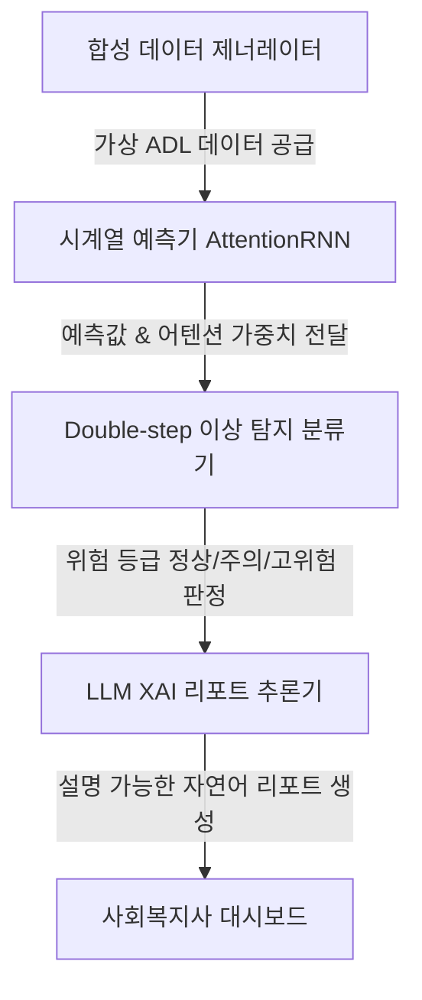

# 시스템 이해관계자 및 에이전트 역할 정의서 (Stakeholder Analysis)

본 문서는 예방적 돌봄 AI 에이전트 시스템에 직간접적으로 영향을 미치는 인간 이해관계자(인간 액터)와 시스템 내부에서 핵심 책임을 수행하는 소프트웨어 컴포넌트(시스템 에이전트)의 역할을 정의하고, 이들 간의 인터랙션 방식을 정립하기 위해 작성되었습니다.

---

## 1. 인간 이해관계자 (Human Stakeholders)

### 1.1. 주요 행위자 (Primary Actor)
#### 독거노인 (Elderly Living Alone)
* **페인포인트**:
  * 스마트홈 내 카메라, 마이크 등 직접적인 모니터링 장비 설치로 인한 극심한 사생활(Privacy) 침해 우려.
  * 급격한 신체적·정신적 악화 발생 시 스스로 비상벨을 누르거나 신고하기 어려운 상태 봉착.
* **기대 가치**:
  * 일상생활을 자유롭게 영위하는 와중에 프라이버시가 침해되지 않는 비침습적 환경에서의 예방 돌봄.
* **시스템 인터랙션**:
  * 시스템을 직접적으로 조작하거나 데이터를 입력하지 않음.
  * 거주지 내 비침습적 환경(가상 CASAS 센서 기준)에서 발생하는 수면, 위생, 식사 등의 행동 패턴이 일간 행동 점유율(%) 형태로 수집되어 분석 파이프라인의 기초 소스로 기능함.

### 1.2. 핵심 사용자 (Core Users)
#### 사회복지사 및 생활지원사 (Social Worker / Caregiver)
* **페인포인트**:
  * 한 명의 돌봄 인력이 관리해야 하는 대상자 수가 너무 많아(1인당 수십 명) 예방적 상시 모니터링이 불가능함.
  * 복잡한 그래프, 인공지능 수치(예: MAE, 오차값)는 업무 현장에서 직관적으로 이해하기 힘듦.
* **기대 가치**:
  * 관내 대상자 중 선제적인 방문과 조치가 필요한 '고위험 노인' 리스트를 신속하게 필터링.
  * 해당 노인이 왜 위험 상태인지 쉽게 이해할 수 있는 자연어 리포트를 통해 즉각적인 돌봄 대응 개시.
* **시스템 인터랙션**:
  * 돌봄 관리 대시보드 화면을 통해 위험군 리스트를 실시간으로 모니터링.
  * 시스템이 생성한 **LLM XAI 돌봄 리포트**를 조회하고, 현장 검증 후 리포트의 정탐/오탐 여부를 피드백으로 등록.

#### 가족 및 보호자 (Family / Guardian)
* **페인포인트**:
  * 독거노인과 떨어져 살면서 평소 식사나 취침 등의 일상 안부를 수시로 파악하지 못하는 막연한 불안감.
* **기대 가치**:
  * 부모님의 일상 안녕 상태를 한눈에 볼 수 있는 친근하고 가독성 높은 요약 정보 제공.
* **시스템 인터랙션**:
  * '주의' 및 '고위험' 상태로 판별되어 사회복지사의 검증이 완료된 시점에 알림 서비스(SMS, 전용 모바일 앱 등) 형태로 요약 보고서를 전달받음.

---

## 2. 시스템 에이전트 (System Agents - 소프트웨어 행위자)

### 2.1. 합성 데이터 제너레이터 (Synthetic Data Generator)
* **책임 및 기대 가치**:
  * 물리 센서가 부재한 연구 한계를 타파하기 위해, CASAS 표준 스키마 규격을 준수하는 41개 일상 활동(ADL)의 일간 행동 시간 점유율(%) 데이터를 통계적 난수 및 시나리오 변이를 적용해 생성함.
* **시스템 인터랙션**:
  * 데이터 생성 파라미터(사용자 맞춤형 패턴, 노이즈율, 비정상 행동 발생 시나리오 등)를 입력받아 일간 시계열 데이터셋(CSV/Parquet 등) 형태로 출력함.

### 2.2. 시계열 예측기 (AttentionRNN Predictor)
* **책임 및 기대 가치**:
  * 과거 15일간의 다변량 시계열 활동 점유율 데이터를 학습하여, 16일 차에 발생할 예측 행동 분포를 점유율 단위로 추론함. 
  * Self-Attention 메커니즘을 적용하여 15일 중 어떤 날의 행동이 16일 차 예측에 지대한 영향을 미쳤는지 가중치를 산정함.
* **시스템 인터랙션**:
  * 합성 데이터셋으로부터 15일 길이의 윈도우 슬라이드를 입력받아 16일 차 예측 텐서와 어텐션 가중치 맵을 출력함.

### 2.3. Double-step 이상 탐지 분류기 (Double-step Anomaly Classifier)
* **책임 및 기대 가치**:
  * 예측값과 실측값 간의 평균절대오차(MAE)를 Z-score로 계량화하고, 각 활동의 과거 이상 경향을 Boxplot 임계값으로 비교 분석하여 오탐 없이 위험 등급을 **정상 / 주의 / 고위험**으로 분류함.
* **시스템 인터랙션**:
  * 시계열 예측기의 출력값과 16일 차 실측값을 전달받아 Z-score 수학 연산을 수행하고 분류된 위험 메타데이터 패킷을 LLM 컴포넌트로 전달함.

### 2.4. LLM XAI 리포트 추론기 (LLM XAI Report Reasoner)
* **책임 및 기대 가치**:
  * 구조화된 입력 정보(위험도 등급, Z-score, 편차가 큰 핵심 활동명 및 수치, 어텐션 가중치)를 바탕으로, 비전문가가 한눈에 이해하고 공감할 수 있는 설명 중심의 정교한 한글 예방 돌봄 보고서를 도출함.
* **시스템 인터랙션**:
  * 위험도 판정 결과 패킷과 프롬프트 템플릿을 컨텍스트로 주입(Context Injection)받아 자연어 텍스트 파일 형태의 돌봄 보고서를 최종 생성함.
