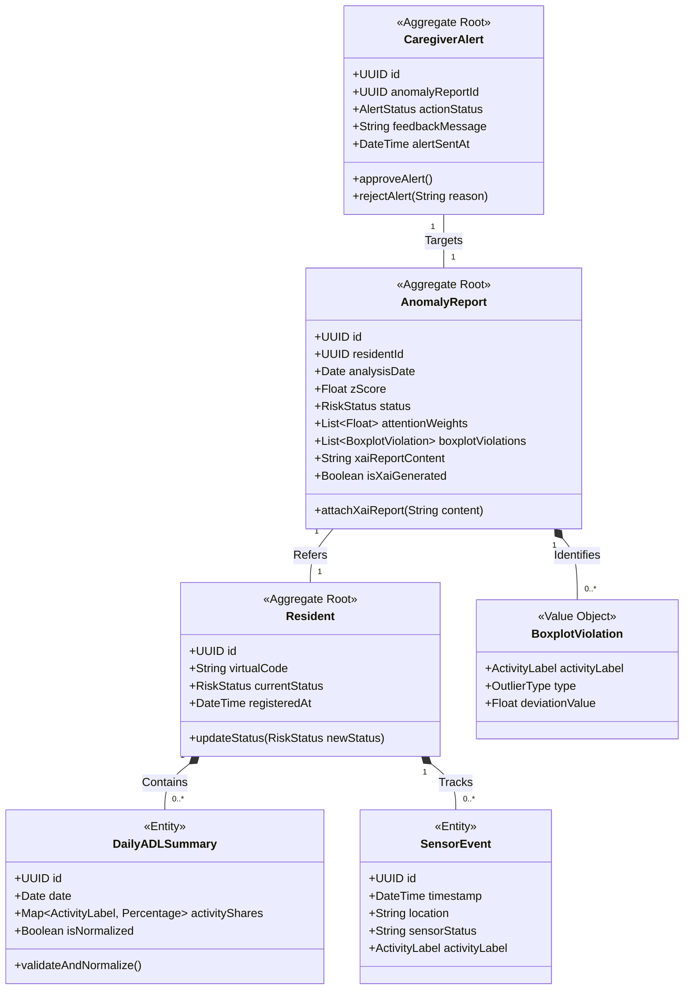

# 개념적 도메인 모델 설계서 (Domain Model Design)

본 문서는 예방적 돌봄 AI 에이전트 시스템의 요구사항을 구현하기 위해 도메인 주도 설계(DDD) 방법론을 적용하여 핵심 비즈니스 개념을 엔터티(Entity), 밸류 오브젝트(Value Object), 그리고 애그리거트(Aggregate) 경계로 분할하고 관계를 구조화하기 위해 작성되었습니다.

---

## 1. 도메인 애그리거트 설계 (Domain Aggregate Design)

---

## 2. 애그리거트 내부 구성 요소 상세 명세

### 2.1. Resident (피돌봄 독거노인) 애그리거트
* **책임**: 독거노인의 기초 행동 수집 단위이자 전체 이상 상태의 중심 맥락입니다.
* **[Aggregate Root] Resident (Entity)**:
  * *속성*: `id` (익명 UUID v4), `virtualCode` (개인식별정보를 차단하기 위한 난수화된 연구 식별자), `currentStatus` (정상/주의/고위험 상태값), `registeredAt` (등록 일자).
  * *비즈니스 규칙*: 노인의 개인식별정보(PII)는 절대 시스템 엔터티에 직접 노출될 수 없습니다.
* **DailyADLSummary (Entity)**:
  * *속성*: `id` (식별자), `date` (요약 날짜), `activityShares` (41개 활동별 하루 점유비 백분율 맵), `isNormalized` (정규화 완료 플래그).
  * *비즈니스 규칙*: 생성된 하루의 41개 일상 활동 점유율 합은 반드시 $100.00\%$ ($\pm 0.01\%$ 오차) 범위를 고수해야 합니다. `Resident`에 소속되어 생명주기를 같이 합니다.
* **SensorEvent (Entity)**:
  * *속성*: `id` (이벤트 식별자), `timestamp` (발생 시간), `location` (센서 설치 공간명 - 예: Bath, Kitchen), `sensorStatus` (센서 동작 상태값 - 예: ON, OFF), `activityLabel` (행동 분류 라벨).
  * *비즈니스 규칙*: 가상 CASAS 합성 데이터 제너레이터로부터 매일 자정 배치 수집되는 최하위 로우 로그 데이터입니다.

### 2.2. Analysis (이상치 분석) 애그리거트
* **책임**: 시계열 분석 결과와 Z-score 산정, 박스플롯 IQR 검증 및 LLM XAI 리포트 생성을 담당하는 분석 컨텍스트입니다.
* **[Aggregate Root] AnomalyReport (Entity)**:
  * *속성*: `id` (보고서 식별자), `residentId` (노인 식별자 참조), `analysisDate` (분석 대상 일자), `zScore` (MAE 오차 Z-score 수치), `status` (정상/주의/고위험 등급), `attentionWeights` (15일간의 Attention 가중치 목록), `xaiReportContent` (XAI 한글 요약 리포트 텍스트), `isXaiGenerated` (리포트 생성 여부 플래그).
  * *비즈니스 규칙*: `zScore`가 $2.5$를 상회하거나 활동별 Boxplot 임계 이탈이 확인되는 경우 반드시 위험도 상태는 `Danger`로 등급 산정되며, XAI 리포트 문두에는 의료 진단이 아님을 밝히는 강제 주의 구문이 삽입됩니다.
* **BoxplotViolation (Value Object)**:
  * *속성*: `activityLabel` (이상 발생 활동 라벨), `type` (임계 이탈 종류 - High/Low), `deviationValue` (역사적 임계치 대비 오차 거리).
  * *비즈니스 규칙*: 임계 위반 내역은 식별자를 필요로 하지 않는 불변의 통계 측정 데이터 패킷입니다.

### 2.3. Alert (돌봄 비상 경보) 애그리거트
* **책임**: 이상 분석 결과를 돌봄 실무자(사회복지사)가 검증하여 실제 비상 연락망(보호자)으로 송출하기 위한 흐름을 제어합니다.
* **[Aggregate Root] CaregiverAlert (Entity)**:
  * *속성*: `id` (알림 식별자), `anomalyReportId` (대상 분석 보고서 ID), `actionStatus` (대기/승인/반려 상태), `feedbackMessage` (복지사의 정탐/오탐 피드백 및 현장 조치록 메모), `alertSentAt` (경보 송출 시간).
  * *비즈니스 규칙*: 사회복지사가 분석 카드를 보고 현장 전화를 거쳐 `Approve`를 클릭하기 전에는 보호자에게 안심 요약 알림이 전송되지 않으며, `Reject`(오탐) 판정 시에는 오탐 피드백이 분석 엔진의 향후 보정 지표로 데이터베이스에 기록되어야 합니다.
