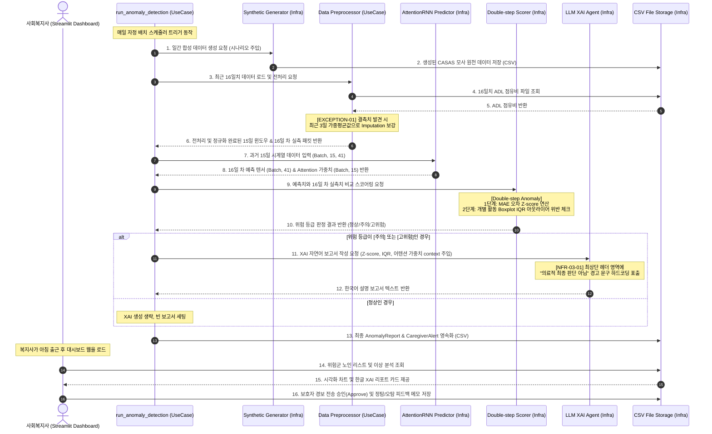

# 시스템 아키텍처 설계서 (System Architecture Design)

본 문서는 예방적 돌봄 AI 에이전트 시스템의 요구사항 및 도메인 모델을 기술적으로 만족하고 계층 간 의존성 제어를 극대화하기 위해, 클린/헥사고날 아키텍처(Clean/Hexagonal Architecture) 개념을 적용하여 서브시스템 경계, 폴더 구조, 그리고 시퀀스 다이어그램을 설계한 내역을 기록합니다.

---

## 1. 아키텍처 개요 및 계층 분리 규칙

의존성의 방향은 외부(프레임워크, 라이브러리, 입출력 장치)에서 내부(도메인 엔터티, 순수 비즈니스 규칙)로만 향하며, 핵심 비즈니스 로직은 어떠한 외부 기술(데이터베이스 종류, 프론트엔드 프레임워크, 외부 API 통신 규격)에도 종속되지 않도록 격리 설계합니다.

```
┌────────────────────────────────────────────────────────────────────────┐
│                        INFRASTRUCTURE LAYER (Adapters)                │
│   ┌────────────────────────────────────────────────────────────────┐   │
│   │                     USE CASES LAYER (Ports)                    │   │
│   │   ┌────────────────────────────────────────────────────────┐   │   │
│   │   │                     DOMAIN CORE LAYER                  │   │   │
│   │   │   * Resident Entity                                    │   │   │
│   │   │   * DailyADLSummary Entity                             │   │   │
│   │   │   * AnomalyReport Aggregate (zScore, XAI)              │   │   │
│   │   │   * CaregiverAlert Aggregate                           │   │   │
│   │   └────────────────────────────────────────────────────────┘   │   │
│   │   * RunAnomalyDetectionUseCase                             │   │   │
│   │   * GenerateXaiReportUseCase                               │   │   │
│   │   * SupplySyntheticDataUseCase                             │   │   │
│   └────────────────────────────────────────────────────────────────┘   │
│   * PyTorch AttentionRNN Model Impl                            │   │
│   * CSV File Storage Reader/Writer                             │   │
│   * OpenAI/Local LLM Client                                    │   │
│   * Streamlit Web Presentation Dashboard                       │   │
└────────────────────────────────────────────────────────────────────────┘
```

---

## 2. 폴더 트리 구조 (Folder Tree Structure)

MVP의 신속한 구현과 명확한 계층 분리를 지원하는 파이썬 기반 폴더 구조를 아래와 같이 동결합니다.

```
d:\연구실\연구\스마트시티개론\
├── docs/                             # 기획, 요구사항, 설계 마크다운 문서 저장소
│   ├── 00_context_management/        # 상태 관리 (DECISIONS, context_packet 등)
│   ├── 01_goals/                     # 기획 목표 및 이해관계자 정의서
│   ├── 02_requirements/              # 요구사항 명세서 및 MVP 스코프 정의서
│   └── 03_design/                    # 도메인 모델 및 아키텍처 설계서
├── src/                              # 시스템 실행 소스코드 루트
│   ├── domain/                       # DDD 도메인 레이어 (순수 비즈니스 로직, 외부 라이브러리 의존성 제로)
│   │   ├── __init__.py
│   │   ├── resident.py               # Resident, DailyADLSummary, SensorEvent 엔터티
│   │   ├── anomaly.py                # AnomalyReport 엔터티, BoxplotViolation 밸류 오브젝트
│   │   └── alert.py                  # CaregiverAlert 엔터티 및 상태 분류값
│   ├── usecases/                     # 애플리케이션 유스케이스 레이어 (동작 흐름 오케스트레이션 및 포트 선언)
│   │   ├── __init__.py
│   │   ├── supply_synthetic_data.py  # 합성 데이터 생성 흐름
│   │   ├── preprocess_adl_data.py    # 데이터 전처리 및 결측치 가중평균 보강 실행
│   │   ├── run_anomaly_detection.py  # AttentionRNN 추론 및 Double-step 검증 실행
│   │   └── generate_xai_report.py    # LLM XAI 돌봄 요약 보고서 도출 실행
│   ├── infrastructure/               # 인프라스트럭처 레이어 (세부 외부 기술 어댑터 구현체)
│   │   ├── __init__.py
│   │   ├── generators/               # CASAS 표준 규격 합성 데이터 동적 제너레이터 엔진
│   │   ├── models/                   # PyTorch 기반 AttentionRNN 신경망 아키텍처 및 훈련 모듈
│   │   ├── scorers/                  # Z-score 및 Boxplot IQR 이상치 스코어링 모듈
│   │   ├── llm/                      # API 통신 클라이언트 및 XAI 프롬프트 엔지니어링 템플릿
│   │   └── persistence/              # CSV 파일 입출력 및 메모리 버퍼 윈도우 관리 어댑터
│   └── presentation/                 # 표현 레이어 (사용자 화면 인터페이스)
│       ├── __init__.py
│       └── app.py                    # Streamlit 기반 예방 돌봄 대시보드 메인 진입점
├── tests/                            # BDD 시나리오 기반의 테스트 하네스 검증 코드
│   ├── test_generators.py            # 합성 데이터 정규화 및 수치 정합성 테스트
│   ├── test_models.py                # AttentionRNN 모델 입출력 텐서 및 가중치 추출 테스트
│   └── test_usecases.py              # 유스케이스 결측치 보강 및 예외 처리 흐름 테스트
└── requirements.txt                  # MVP 기술 스택 의존성 패키지 명세서
```

---

## 3. 파이프라인 시퀀스 다이어그램 (Sequence Diagram)

매일 자정 배치 스케줄러에 의해 동작하는 합성 데이터 생성부터 사회복지사 피드백까지의 엔드투엔드(End-to-End) 데이터 흐름과 호출 구조를 도식화합니다.


