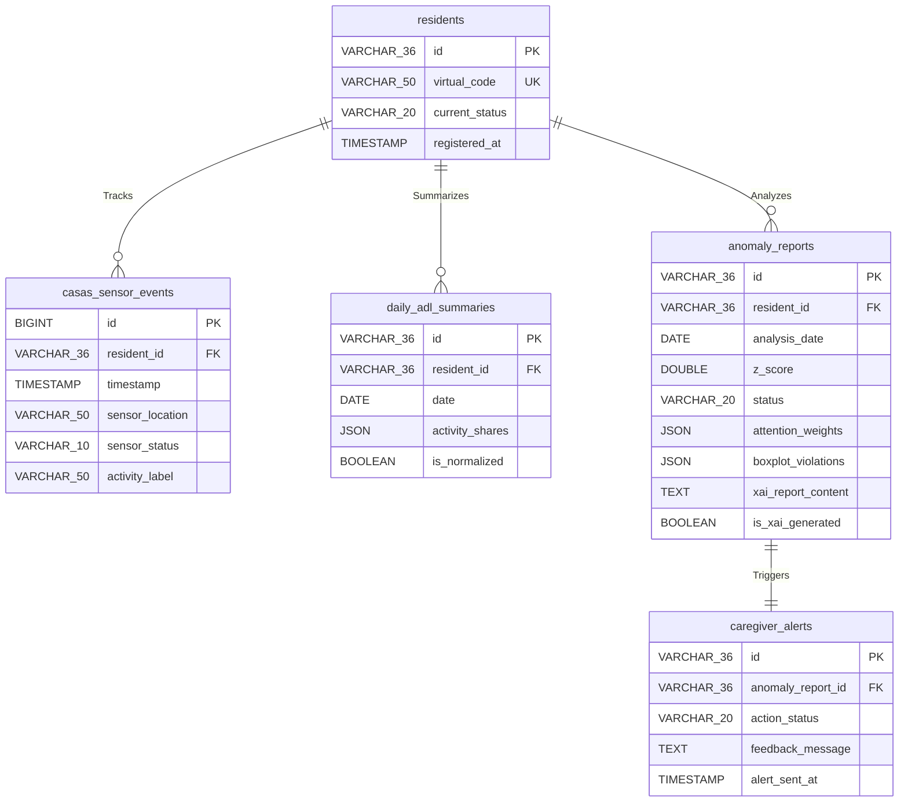

# 데이터베이스 스키마 설계서 (Database Schema Design)

본 문서는 예방적 돌봄 AI 에이전트 시스템의 요구사항 및 도메인 애그리거트 모델을 물리적 저장 계층으로 구현하기 위해, CASAS 가상 원시 로그 및 일별 ADL 점유율 데이터의 테이블 스펙, 제약조건, 그리고 성능 최적화를 위한 인덱스(Index) 전략을 명세한 내역을 기록합니다.

---

## 1. 개요 및 스키마 아키텍처 전략

본 MVP 시스템은 파일 시스템 기반 영속화(CSV 파일 저장)의 효율성과 구조적 일관성을 확보하고, 필요시 SQLite/PostgreSQL 등 관계형 데이터베이스로 즉각 마이그레이션이 가능하도록 **정규화된 관계형 데이터 모델**을 수립합니다. 모든 ID 체계는 개인정보 보호 및 격리를 위해 `UUID v4`를 기본 물리 키로 채택합니다.

---

## 2. Mermaid Entity-Relationship 다이어그램 (erDiagram)

---

## 3. 물리 테이블 명세 (Tables Specification)

### 3.1. `residents` (피돌봄 노인 테이블)
* **설명**: 피돌봄 노인의 비식별 상태 정보를 격리 관리하는 마스터 테이블입니다.

| 컬럼명 | 데이터 타입 | NULL 여부 | 제약조건 | 설명 |
| :--- | :--- | :--- | :--- | :--- |
| `id` | VARCHAR(36) | NOT NULL | PRIMARY KEY | 노인 식별자 (UUID v4) |
| `virtual_code` | VARCHAR(50) | NOT NULL | UNIQUE KEY | 난수화된 마스킹 연구 코드 |
| `current_status` | VARCHAR(20) | NOT NULL | Default 'NORMAL' | 현재 위험 등급 ('NORMAL', 'WARNING', 'DANGER') |
| `registered_at` | TIMESTAMP | NOT NULL | Default Current_Timestamp | 최초 등록 일시 |

### 3.2. `casas_sensor_events` (CASAS 가상 원시 로그 테이블)
* **설명**: 합성 데이터 생성기에서 실시간/배치 생성되는 로우 레벨 센서 감지 로그 테이블입니다.

| 컬럼명 | 데이터 타입 | NULL 여부 | 제약조건 | 설명 |
| :--- | :--- | :--- | :--- | :--- |
| `id` | BIGINT | NOT NULL | PRIMARY KEY, AUTO_INCREMENT | 이벤트 고유 식별 일련번호 |
| `resident_id` | VARCHAR(36) | NOT NULL | FOREIGN KEY -> `residents.id` | 대상 노인 식별자 |
| `timestamp` | TIMESTAMP | NOT NULL | - | 센서 물리 작동 시점 |
| `sensor_location`| VARCHAR(50) | NOT NULL | - | 센서 부착 공간명 (예: 'Bedroom', 'Kitchen') |
| `sensor_status` | VARCHAR(10) | NOT NULL | - | 센서 온/오프 상태값 ('ON', 'OFF') |
| `activity_label` | VARCHAR(50) | NOT NULL | - | 41개 핵심 ADL 행동명 (예: 'Sleep', 'Cook') |

### 3.3. `daily_adl_summaries` (일별 전처리 ADL 점유율 요약 테이블)
* **설명**: 자정 전처리 배치에 의해 24시간 동안의 센서 이벤트를 집계한 41개 활동의 시간 점유비(%) 요약 테이블입니다.

| 컬럼명 | 데이터 타입 | NULL 여부 | 제약조건 | 설명 |
| :--- | :--- | :--- | :--- | :--- |
| `id` | VARCHAR(36) | NOT NULL | PRIMARY KEY | 점유율 요약 식별자 (UUID v4) |
| `resident_id` | VARCHAR(36) | NOT NULL | FOREIGN KEY -> `residents.id` | 대상 노인 식별자 |
| `date` | DATE | NOT NULL | - | 요약 기준일자 (Format: YYYY-MM-DD) |
| `activity_shares`| JSON | NOT NULL | - | 41개 ADL 명칭 및 점유율 백분율 수치 저장 맵 |
| `is_normalized` | BOOLEAN | NOT NULL | Default FALSE | 41개 활동 점유율 총합 $100.00\%$ 검증 여부 |

### 3.4. `anomaly_reports` (이상 탐지 보고서 테이블)
* **설명**: AttentionRNN 및 Double-step 판정 결과와 LLM XAI 보고서 원문이 적재되는 최종 보고서 테이블입니다.

| 컬럼명 | 데이터 타입 | NULL 여부 | 제약조건 | 설명 |
| :--- | :--- | :--- | :--- | :--- |
| `id` | VARCHAR(36) | NOT NULL | PRIMARY KEY | 보고서 식별자 (UUID v4) |
| `resident_id` | VARCHAR(36) | NOT NULL | FOREIGN KEY -> `residents.id` | 대상 노인 식별자 |
| `analysis_date` | DATE | NOT NULL | - | 이상 탐지 분석 수행일 |
| `z_score` | DOUBLE | NOT NULL | - | 예측 MAE 오차의 통계적 Z-score 환산값 |
| `status` | VARCHAR(20) | NOT NULL | - | 이상 탐지 최종 등급 ('NORMAL', 'WARNING', 'DANGER') |
| `attention_weights`| JSON | NOT NULL | - | RNN 예측에 주요 영향을 준 15일간의 가중치 배열 |
| `boxplot_violations`| JSON | NOT NULL | - | 역사적 Boxplot IQR 위반 상세 목록 데이터 |
| `xai_report_content`| TEXT | NULL | - | LLM이 자동 생성한 자연어 한국어 리포트 원문 |
| `is_xai_generated`| BOOLEAN | NOT NULL | Default FALSE | 리포트 생성 완료 플래그 |

### 3.5. `caregiver_alerts` (돌봄 비상 경보 및 피드백 테이블)
* **설명**: 사회복지사 대시보드의 경보 게이트웨이 및 정오탐 피드백 메모 이력 저장 테이블입니다.

| 컬럼명 | 데이터 타입 | NULL 여부 | 제약조건 | 설명 |
| :--- | :--- | :--- | :--- | :--- |
| `id` | VARCHAR(36) | NOT NULL | PRIMARY KEY | 비상 경보 식별자 (UUID v4) |
| `anomaly_report_id`| VARCHAR(36) | NOT NULL | FOREIGN KEY -> `anomaly_reports.id`| 대상 리포트 식별자 |
| `action_status` | VARCHAR(20) | NOT NULL | Default 'PENDING' | 처리 현황 상태 ('PENDING', 'APPROVED', 'REJECTED') |
| `feedback_message`| TEXT | NULL | - | 사회복지사의 정오탐 판정 사유 및 조치 사항 메모 |
| `alert_sent_at` | TIMESTAMP | NULL | - | 보호자 실제 비상 알림 발송 완료 시점 |

---

## 4. 인덱스(Index) 최적화 전략 (Index Optimization)

15일간의 시계열 배치 데이터의 반복 로딩 성능을 최적화하기 위해 다음과 같은 복합 인덱스(Compound Index) 배치를 강력히 규정합니다.

### 4.1. `idx_sensor_events_resident_time`
* **대상**: `casas_sensor_events(resident_id, timestamp)`
* **효과**: 특정 노인의 24시간 동안의 센서 작동 이벤트를 취합하여 41개 활동별로 초고속 배치 집계 연산을 보장합니다.

### 4.2. `idx_adl_summary_resident_date`
* **대상**: `daily_adl_summaries(resident_id, date)`
* **효과**: AttentionRNN 예측 엔진이 1회 구동 시점마다 과거 15일간의 슬라이딩 윈도우 점유율 데이터를 디스크/스토리지로부터 로딩할 때 발생하는 I/O 레이턴시를 최소화합니다.

### 4.3. `idx_anomaly_report_resident_date`
* **대상**: `anomaly_reports(resident_id, analysis_date)`
* **효과**: 특정 노인의 역사적 이상치 변동 트렌드를 대시보드 그래프에 신속히 렌더링하고, 이력 분석 시 속도를 보장합니다.
